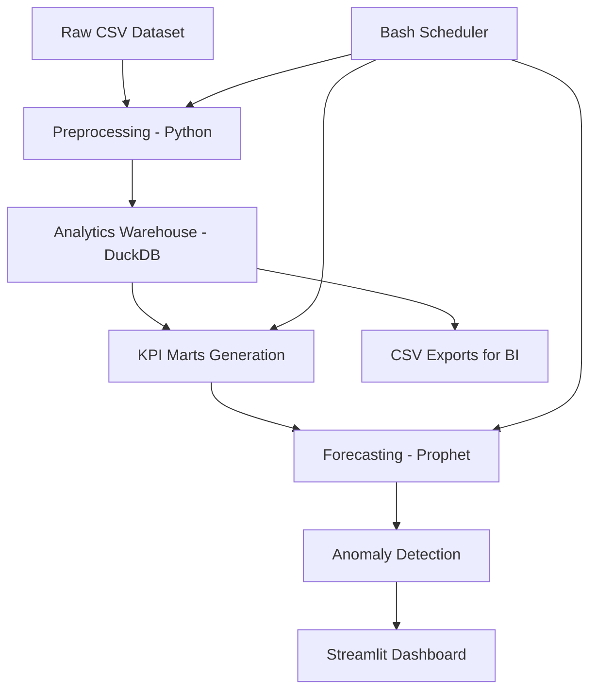

# 📊 Financial Transaction Monitoring & Forecasting System

An end-to-end Business Intelligence (BI) analytics project that transforms raw credit card transaction data into decision-ready insights through KPI modeling, forecasting, anomaly detection, and interactive visualization.

This project simulates how modern analytics teams monitor financial operations, detect unusual patterns, and support data-driven decision-making.

---

## 🚀 Project Overview

This system processes **1.29M+ credit card transactions** to:

- Build daily KPI marts
- Forecast transaction trends
- Detect anomalies using statistical confidence intervals
- Provide an interactive monitoring dashboard

The project demonstrates practical BI skills including data engineering, KPI modeling, automation, and forecasting.

---

## 🎯 Business Objective

Organizations need reliable systems to:
- Monitor transaction volumes and spending behavior
- Detect unusual operational patterns early
- Understand seasonality and performance trends
- Support decision-makers with timely insights

This project replicates a real-world monitoring workflow used in financial analytics teams.

---

## 📂 Dataset

The dataset contains **1.29M+ credit card transactions** including:

- transaction timestamps
- transaction amount
- merchant information
- location data
- fraud indicator
- customer attributes

The data enables time-series KPI analysis and anomaly detection.

---

## 🛠 Technology Stack

- **Python** — data processing & forecasting
- **DuckDB** — analytical SQL marts
- **Pandas** — data transformation
- **Facebook Prophet** — time-series forecasting
- **Streamlit** — interactive dashboard
- **Plotly** — visualization
- **Bash** — workflow automation

---

## 🏗 Architecture Diagram



---

## 🔄 Data Pipeline Steps

1. Clean and transform raw transaction data
2. Generate daily KPI marts using SQL
3. Apply forecasting models
4. Flag anomalies using confidence intervals
5. Visualize results interactively

---

## 📈 KPIs Built

- Daily transaction volume
- Total spend
- Average ticket size
- Unique customers
- Unique merchants
- Fraud rate

These KPIs help monitor operational performance and financial risk.

---

## 🔍 Forecasting & Anomaly Detection

Forecasting is performed using **Facebook Prophet** to capture:
- weekly seasonality
- long-term trends
- expected value ranges

Anomalies are flagged when actual values fall outside forecast confidence intervals.

---

## 📊 Interactive Dashboard

The Streamlit dashboard enables:

- metric selection
- anomaly highlighting
- forecast confidence bands
- date range filtering
- KPI summary view

This allows stakeholders to quickly identify unusual trends.

---

## 📁 Project Structure

```
fin-txn-monitoring/
  data/
    raw/
    outputs/
  sql/
  src/
  dashboards/
  run/
  app.py
  README.md
```

---

## ⚙️ How to Run

### Install dependencies
```bash
pip install pandas duckdb prophet streamlit plotly
```

### Run pipeline
```bash
python src/preprocess.py
python src/build_marts_duckdb.py
python src/forecast_prophet.py
python src/anomaly_flags.py
```

### Launch dashboard
```bash
streamlit run app.py
```

---

## 📌 Key Learnings

- Designing KPI frameworks for monitoring systems
- Building scalable analytical pipelines
- Applying forecasting to operational metrics
- Detecting anomalies using statistical boundaries
- Creating interactive BI dashboards

---

## 🧠 Future Enhancements

- Category-level drilldowns
- Regional performance analysis
- Real-time streaming simulation
- Automated alert system
- Advanced anomaly scoring

---

## 👤 Author

Abhishek Kumar  
MSc Business Analytics  
Maynooth University  

---

## ⭐ Final Note

This project demonstrates the practical application of Business Intelligence principles in financial analytics, combining technical rigor with business relevance.
